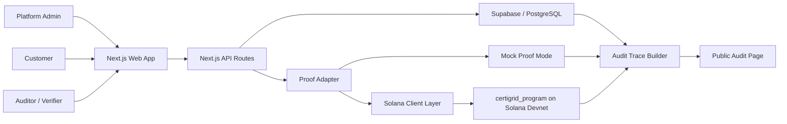

# Certigrid Architecture

## 1. Purpose

This document describes the architecture needed to reach the Certigrid MVP objective defined in the root `README.md`.

Certigrid is a Web3-enabled platform for renewable energy certificate traceability and marketplace operations. The MVP must demonstrate an end-to-end lifecycle:

1. Admin registers renewable energy assets.
2. The platform simulates renewable energy measurements.
3. Approved measurements receive deterministic proof records.
4. Measurements are aggregated into certificate batches.
5. Certificate batches receive deterministic proof records.
6. Customers negotiate or request certificates.
7. Purchase or allocation is confirmed.
8. Certificate ownership and status are updated.
9. Any user can verify certificate traceability through a public audit module.

Until final Solana integration, proof records use mocked transaction references. The final integration phase replaces those mocked references with real Solana Devnet transactions.

The architecture must support this story without pretending to be a production REC or iREC registry.

## 2. Architecture Principles

### 2.1 MVP first

The system should prove lifecycle clarity, traceability, and user comprehension before optimizing for scale.

Trade-off:

- This keeps delivery realistic for a hackathon or proof of concept.
- Some production concerns, such as enterprise identity, full compliance, indexer resiliency, and formal audit controls, stay out of scope.

### 2.2 Off-chain system of work, on-chain system of proof

Certigrid should use the application database as the operational system of record and Solana as the integrity and audit layer.

Delivery decision:

- Build the frontend and application backend lifecycle first.
- Generate deterministic hashes and mocked transaction references through the proof adapter.
- Integrate real Solana Devnet transactions only after the lifecycle, audit trace, and application rules are demonstrable.

Store off-chain:

- Detailed asset metadata.
- Simulation rules.
- Generated measurement details.
- Negotiation messages.
- UI state.
- Search and filtering data.
- Customer portfolio views.

Store or reference on-chain:

- Asset references.
- Measurement hashes.
- Certificate batch records.
- Certificate claim references.
- Allocation and ownership events.
- Status change events.
- Lifecycle verification data.

Trade-off:

- Keeping detailed mutable business data off-chain makes the MVP easier to evolve.
- On-chain hashes and references still provide verifiability and audit value.

### 2.3 Traceability before market complexity

The marketplace should be simple. Its purpose is to prove that a certificate batch can be discovered, negotiated, allocated, and verified.

Out of scope:

- Stablecoin settlement.
- Secondary markets.
- KYC/KYB.
- Legal contracts.
- Production-grade certification.

### 2.4 Domain-driven module boundaries

The architecture should be organized around the Certigrid lifecycle, not only technical layers.

Core modules:

- Energy Asset and Administration.
- Simulation and Measurement.
- Certificate Batch Management.
- Customer Marketplace.
- Negotiation and Claim Management.
- Public Audit and Traceability.
- Solana Program Integration.

## 3. Target Technical Stack

The README defines this MVP stack:

| Area | Technology |
| --- | --- |
| Frontend | Next.js, React, TypeScript, Tailwind CSS |
| Backend | Next.js API routes |
| Database | Supabase / PostgreSQL |
| Blockchain | Solana Devnet, Anchor Framework, Rust |
| Wallet | Solana Wallet Adapter |
| Deployment | Vercel, Supabase, public GitHub repository |

Recommended repository structure:

```text
Certigrid/
  README.md
  docs/
    ARCHITECTURE.md
    PLAN.md
    ROADMAP.md
  apps/
    web/
  programs/
    certigrid_program/
  packages/
    shared/
  supabase/
    migrations/
  .codex/
    skills/
```

This structure keeps the product documentation, web application, Solana program, shared domain types, and database assets separated.

## 4. Logical Architecture



The web app is the main interface for all MVP roles. API routes enforce domain rules, persist off-chain records, and call the proof adapter when lifecycle events require a proof reference. Before final Solana integration, the adapter returns mocked transaction references. In the final phase, it submits real Solana transactions.

## 5. Module Architecture

### 5.1 Energy Asset and Administration

Purpose:

- Let admins register and manage renewable energy assets.
- Define basic asset metadata, owner wallet, capacity, energy source, and operational status.

Main records:

- `EnergyAsset`
- asset metadata hash
- asset status history

Primary flows:

- Register asset off-chain.
- Generate metadata hash.
- Generate mocked proof transaction reference through the proof adapter.
- Later replace the mock proof with `register_asset` on Solana Devnet.
- Display transaction reference and proof status.

Key risk:

- If mocked proof records use a different shape from future Solana records, the integration phase will require rework.

### 5.2 Simulation and Measurement

Purpose:

- Generate credible simulated energy measurements for registered assets.
- Let admins approve or reject measurements.
- Register approved measurements through the proof adapter, using mocked transaction references until final Solana integration.

Core formula:

```text
Gross Generation (MWh) =
  Installed Capacity (MW) * Period Hours * Capacity Factor * Random Variation

Net Generation (MWh) =
  Gross Generation * Availability Factor * (1 - Curtailment Factor)

Eligible Certificate MWh =
  Net Generation * Eligibility Factor
```

MVP assumptions:

- Eligibility factor is `1.0`.
- `1 MWh = 1 certificate unit`.
- Certificate quantity is `floor(Eligible Certificate MWh)`.

Primary states:

- `DraftOffChain`
- `Approved`
- `RegisteredOnChain`
- `UsedForCertificate`
- `Rejected`

Key invariant:

- A measurement cannot be reused across multiple certificate batches.

### 5.3 Certificate Batch Management

Purpose:

- Aggregate registered measurements into certificate batches.
- Track available certificate quantity and commercial status.
- Register batch creation through the proof adapter, using mocked transaction references until final Solana integration.

Primary states:

- `Available`
- `PartiallyReserved`
- `PartiallySold`
- `SoldOut`
- `Inactive`

Key invariants:

- Only approved and proof-recorded measurements can create a batch.
- Batch quantity equals the sum of eligible MWh from selected measurements.
- Selected measurements are marked `UsedForCertificate`.
- Available quantity cannot go below zero.

### 5.4 Customer Marketplace

Purpose:

- Let customers discover available certificate batches.
- Show origin, vintage, certificate type, quantity, price, and verification references.
- Start negotiation or allocation requests.

MVP constraints:

- No real payment settlement.
- No secondary market.
- No KYC/KYB.
- Negotiation remains off-chain until accepted and converted into a claim.

### 5.5 Negotiation and Claim Management

Purpose:

- Let customers request quantity from a certificate batch.
- Let admins review, counter, accept, reject, expire, or convert requests.
- Register final accepted claims through the proof adapter, using mocked transaction references until final Solana integration.

Negotiation states:

- `Requested`
- `UnderReview`
- `CounterOffered`
- `Accepted`
- `Rejected`
- `Expired`
- `ConvertedToClaim`

Claim states:

- `Requested`
- `Reserved`
- `Purchased`
- `Delivered`
- `Retired`
- `Cancelled`

Key risk:

- Negotiation and claim states can diverge if transitions are not explicit. The MVP should define exactly when an accepted negotiation becomes a claim.

### 5.6 Public Audit and Traceability

Purpose:

- Let any user search by batch ID or claim ID.
- Show the full lifecycle trace from asset registration to claim status.
- Display transaction references, proof status, and metadata hashes. Until final Solana integration, transaction references are mocked.

Minimum trace:

```text
Energy Asset Registered
-> Measurements Generated
-> Measurements Proof-Recorded
-> Certificate Batch Created
-> Certificate Batch Proof-Recorded
-> Customer Claim Created
-> Claim Status Updated
```

Audit data:

- Transaction references.
- Proof mode: mocked or Solana Devnet.
- Metadata hashes.
- Quantity consistency.
- Status history.
- Asset origin.
- Measurement summaries.
- Batch details.
- Claim details.

## 6. Data Architecture

### 6.1 Core off-chain tables

Recommended MVP tables:

- `energy_assets`
- `simulation_rules`
- `measurement_records`
- `certificate_batches`
- `certificate_batch_measurements`
- `negotiations`
- `certificate_claims`
- `lifecycle_events`
- `proof_transactions`

### 6.2 Shared identifiers

Use stable domain identifiers independent from database IDs:

- `asset_id`
- `measurement_id`
- `batch_id`
- `claim_id`

These identifiers should appear in:

- Database records.
- Metadata hashes.
- Solana program accounts or instruction inputs.
- Audit URLs.
- UI screens.

### 6.3 Metadata hashes

Use deterministic hashing for records whose detailed content stays off-chain.

Hash candidates:

- Asset metadata.
- Simulation rule configuration.
- Measurement payload.
- Certificate batch payload.
- Claim metadata.

Risk:

- Hashes are only useful if the same canonical serialization is used consistently. Define one canonical JSON shape before generating hashes.

### 6.4 Proof transactions

Use one application-level proof transaction record shape for both mocked and real proofs.

Recommended fields:

- `proof_transaction_id`
- `related_entity_type`
- `related_entity_id`
- `lifecycle_event_type`
- `proof_mode`
- `status`
- `transaction_reference`
- `metadata_hash`
- `created_at`
- `confirmed_at`

For Phases 2-7, `proof_mode` is `mock` and `transaction_reference` is generated deterministically for demo stability. In the final Solana phase, `proof_mode` becomes `solana_devnet` and `transaction_reference` stores the real transaction signature.

## 7. Proof Adapter and On-Chain Architecture

### 7.1 Proof adapter

The application should call a proof adapter instead of calling Solana directly from feature modules.

Required behavior:

- Accept a lifecycle event and canonical metadata hash.
- Return a normalized proof transaction result.
- Support mock mode through Phases 2-7.
- Support Solana Devnet mode in the final integration phase.
- Preserve failed and pending transaction states without corrupting off-chain lifecycle state.

### 7.2 Program

The MVP uses one Anchor program:

```text
certigrid_program
```

The program contains:

- Asset registry logic.
- Measurement registry logic.
- Certificate batch logic.
- Customer claim logic.

### 7.3 Instructions

Required:

- `register_asset`
- `register_measurement`
- `create_certificate_batch`
- `create_claim`
- `update_claim_status`

Optional:

- `cancel_claim`

### 7.4 Accounts

Core account types:

- `EnergyAsset`
- `MeasurementRecord`
- `CertificateBatch`
- `CertificateClaim`

### 7.5 On-chain constraints

The program should enforce at least:

- Admin authority for asset, measurement, and batch creation.
- Measurement belongs to the referenced asset.
- Measurement cannot be reused for certificate generation.
- Claim quantity cannot exceed available batch quantity.
- Claim status transitions are valid.

MVP trade-off:

- Some validations can be duplicated off-chain for speed of development, but the critical quantity and ownership invariants should be enforced in the application backend before Solana integration and later mirrored or represented in on-chain events.

## 8. Architecture Evolution

### Stage 0: Specification baseline

Current purpose:

- Define product lifecycle, roles, modules, data model, and MVP boundaries.

Deliverables:

- Root README.
- Architecture document.
- Roadmap.
- Incremental plan.

Exit criteria:

- The team understands what must be proven and what is intentionally out of scope.

### Stage 1: Local clickable prototype

Purpose:

- Validate user flows before deep blockchain work.

Architecture:

- Next.js app.
- Static seed data or local in-memory data.
- Mock transaction references.
- No persistent database required.

Risk:

- Mock traces can hide integration complexity. Use this stage only to validate UX and domain flow.

### Stage 2: Database-backed operational MVP

Purpose:

- Make lifecycle state persistent and enforce off-chain rules.
- Use deterministic hashes and mocked transaction references for proof events.

Architecture:

- Next.js app and API routes.
- Supabase / PostgreSQL.
- Domain services for assets, measurements, batches, negotiations, claims, and audit events.
- Proof adapter in mock mode.

Risk:

- If database rules are not aligned with future on-chain rules, integration will cause rework.

### Stage 3: Audit-ready application MVP

Purpose:

- Prove the full traceability workflow before live blockchain work.

Architecture:

- Audit trace builder combines database records, lifecycle events, metadata hashes, and mocked transaction references.
- Public search by `batch_id` or `claim_id`.
- Trace page shows consistency checks and proof status.

Risk:

- Mock proofs can hide integration complexity. Keep the proof adapter contract close to the future Solana result shape.

### Stage 4: Solana Devnet integration

Purpose:

- Register the critical lifecycle proofs on Solana Devnet.

Architecture:

- Anchor program.
- Next.js API routes call the proof adapter in Solana mode.
- Transaction hashes stored in `proof_transactions`.
- On-chain references linked to off-chain records.

Risk:

- Wallet authority, program-derived addresses, and transaction failure recovery can slow delivery. Start with the smallest complete on-chain path.

### Stage 5: Demo-ready release

Purpose:

- Stabilize the end-to-end flow and demo data.

Architecture:

- Seeded demo scenario.
- Deployed web app.
- Supabase project configured.
- Solana Devnet program deployed.
- Public proof URLs available.

Risk:

- A live blockchain dependency can fail during a demo. Keep deterministic seed data and graceful transaction status handling.

### Stage 6: Post-MVP hardening

Purpose:

- Prepare the concept for deeper validation after the hackathon.

Potential additions:

- Dedicated backend worker.
- Event indexer.
- Role-based access control.
- Audit log immutability controls.
- Better transaction retry and reconciliation.
- Optional integration with real registries or settlement systems.

These are outside the initial MVP unless explicitly reprioritized.

## 9. Deployment Architecture

MVP deployment:

```text
User Browser
  -> Vercel-hosted Next.js app
  -> Next.js API routes
  -> Supabase PostgreSQL
  -> Solana Devnet
```

Operational dependencies:

- Vercel environment variables.
- Supabase database URL and service role configuration.
- Solana RPC URL.
- Anchor program ID.
- Admin wallet authority.

## 10. Key Architecture Risks

| Risk | Impact | Mitigation |
| --- | --- | --- |
| On-chain scope is too large | Delays MVP delivery | Keep detailed data off-chain and store compact proofs on-chain |
| Audit page is built too late | Weak blockchain justification | Build traceability as a core milestone, not a final polish item |
| Mocked proof references diverge from Solana results | Final integration requires UI and API rewrites | Use one proof transaction shape for mock and real modes |
| Negotiation and claim states diverge | Inconsistent customer ownership story | Define explicit conversion from accepted negotiation to claim |
| Measurement reuse is not prevented | Invalid certificate supply | Enforce one-time measurement usage in database and program logic |
| Transaction failures are not modeled | Broken demo flow | Store pending, confirmed, and failed transaction states |
| Hashes are inconsistent | Verification cannot be trusted | Define canonical JSON serialization before hashing |

## 11. MVP Architecture Decision

For the MVP, use a modular Next.js application with Supabase persistence and a proof adapter. Treat the database as the operational state layer. Through the frontend and application-backend phases, use deterministic hashes and mocked transaction references. In the final integration phase, connect the proof adapter to one Anchor program on Solana Devnet and replace mocked references with real transaction signatures.

This is the best fit for the README objective because it proves the full certificate lifecycle, keeps delivery realistic, and makes the public audit module the visible justification for blockchain use.
